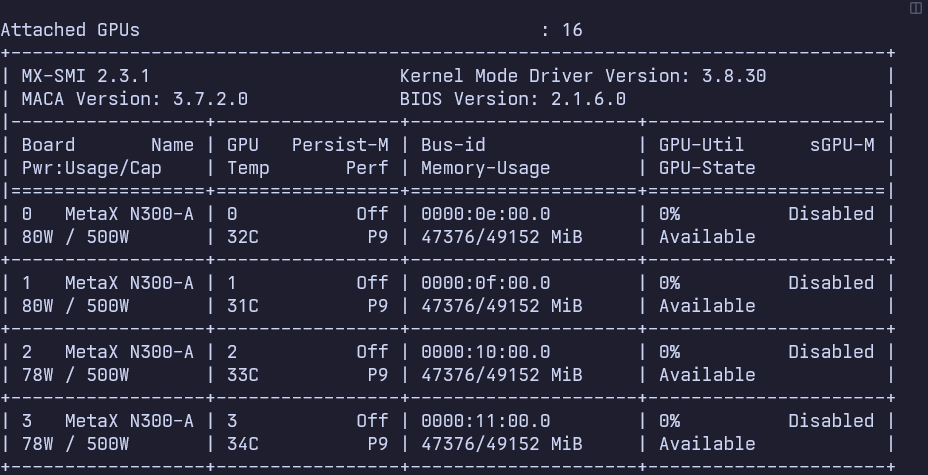
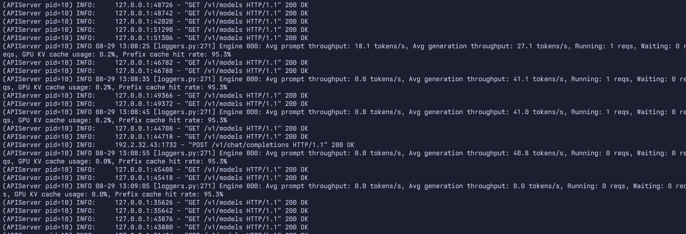
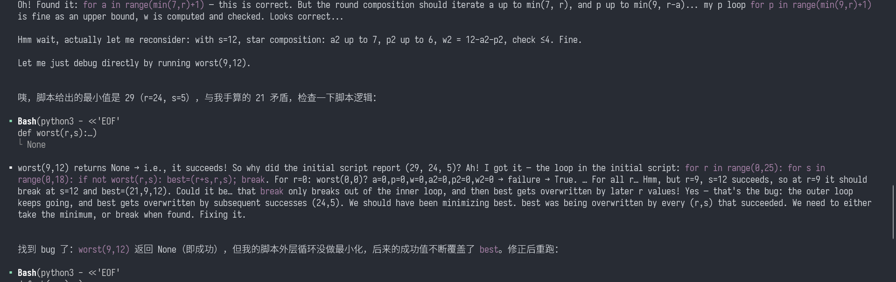
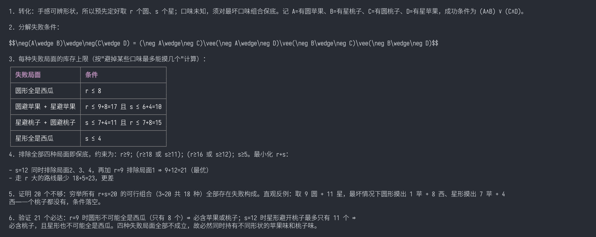
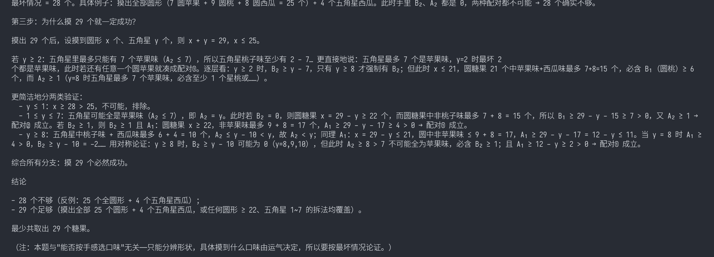

# 【经验分享】沐曦 N300-A × vLLM 部署 Qwen3.8-27B： 蒸馏版横向对比实测

> **首发平台**：ModelScope Qwen3.8-27B 模型讨论区 (Issue)  
> **适用硬件**：国产 GPU 沐曦 MetaX N300-A 系列（工业级多卡集群 / 单卡 48GB HBM）  
> **推理框架**：vLLM 1.0.3 (MACA AI 3.7.0 深度优化版)  
> **测试模型**：
> - 基座模型：`Qwen/Qwen3.8-27B` (BF16，27.78B 参数)
> - 蒸馏增强模型：`TeichAI/Qwen3.8-27B-Fable-Distill` (Claude Fable-5 蒸馏微调版)

---

## 0x01 生产级运行环境

测试机器是 16 卡集群里的一个节点，拿前 4 张卡组 TP=4，软件栈用沐曦官方的 MACA 3.7 生态和 vLLM 定制镜像。

| 配置分类 | 详细参数与版本 | 备注说明 |
| --- | --- | --- |
| **操作系统** | Ubuntu 22.04.4 LTS (Linux 5.15.0-generic) | 生产稳定内核 |
| **算力硬件** | 沐曦 MetaX N300× 4 | 单卡 48GB HBM，共 192GB 显存资源池 |
| **驱动版本** | Kernel Mode Driver (KMD) 3.8.30 | 官方生产驱动 |
| **MACA 框架** | MACA 3.7.2.0 (AI Toolkit 3.7.0.107) | 算子已做适配优化 |
| **监控管理工具** | mx-smi | 沐曦官方 GPU 监控工具 |
| **推理容器镜像** | `modelzoo.llm.vllm:1.0.3-maca.ai3.7.0.107-torch2.8-py310-ubuntu22.04-amd64` | 沐曦官方预编译 vLLM 镜像 |
| **并行策略** | Tensor Parallelism = 4 (TP=4) | 4 卡并行承载 27B 模型 |
| **上下文配置** | `max-model-len = 262144` (256K 原生上限) | 长文档不截断 确保智商最大化 |





---

## 0x02 沐曦 MACA 部署的“三道防崩溃防线”（核心避坑）

国产卡上直接照抄公版 CUDA 的部署脚本，很容易碰到随机崩溃、NCCL 死锁、显存性能抖动这些问题。实测下来有三个环境变量必须加，缺一不可：

### 坑 1：NCCL 通信超时导致整个守护进程被 Watchdog 误杀
* **现象**：在超长文本（如 100K+ Prefill）或网络瞬时抖动时，多卡 AllReduce 计算耗时较长，PyTorch 默认的 NCCL Watchdog 会误判定为死锁，直接发出 `SIGABRT` 强杀整个 vLLM 进程。
* **防线配置**：
  ```bash
  export TORCH_NCCL_WATCHDOG_TIMEOUT=0
  ```
* **原理**：超时不再直接杀进程，而是降级为等待重试，长任务不容易被打断。

### 坑 2：高并发 KV Cache 显存碎片与 HBM 访存抖动
* **现象**：默认页表大小下，并发请求反复创建/释放 KV Cache 会产生显存碎片，跑久了偶尔性能抖动。
* **防线配置**：
  ```bash
  export MACA_SMALL_PAGESIZE_ENABLE=1
  ```
* **原理**：开启小页表模式，PagedAttention 在 HBM 上的访存连续度更好，显存利用更充分。

### 坑 3：社区开源蒸馏模型 Tokenizer 导出兼容性报错
* **现象**：加载社区微调/蒸馏模型（如 `Qwen3.8-27B-Fable-Distill`）时，vLLM 直接报错起不来：
  `ValueError: Tokenizer class TokenizersBackend does not exist or is not currently imported.`
* **根因**：部分作者用 Unsloth/TRL 导出模型时，`tokenizer_config.json` 里写了一个非标准的 `TokenizersBackend` 类名。
* **解法**：把类名改回标准的：
  ```bash
  sed -i "s/\"tokenizer_class\": \"TokenizersBackend\"/\"tokenizer_class\": \"Qwen2Tokenizer\"/g" tokenizer_config.json
  ```

### 坑 4：Dense 模型的算子调度通用路径性能损耗
* **现象**：Qwen3.8-27B 是 Dense 模型，默认 Dispatch 走通用保守路径，算子发射开销偏大。
* **防线配置**：
  ```bash
  export MACA_DIRECT_DISPATCH=1
  ```
* **原理**：启用直通硬件指令队列分发，减少 CPU-GPU 交互延迟，解码吞吐更高。

---

## 0x03 生产部署运行脚本（TP=4 + 256K 上下文）

### 启动脚本 (`start_vllm_qwen3.8_27b.sh`)

```bash
#!/bin/bash


# 1. 注入三道防崩溃环境变量
export MACA_SMALL_PAGESIZE_ENABLE=1
export MACA_DIRECT_DISPATCH=1
export CUDA_VISIBLE_DEVICES=0,1,2,3
export TORCH_NCCL_WATCHDOG_TIMEOUT=0

# 2. 启动 vLLM 推理服务
python3 -m vllm.entrypoints.openai.api_server \
  --model /data/model/Qwen3.8-27B \
  --tensor-parallel-size 4 \
  --pipeline-parallel-size 1 \
  --trust-remote-code \
  --served-model-name "Qwen3.8-27B" "qwen3.8-27b" \
  --max-model-len 262144 \
  --max-num-batched-tokens 8192 \
  --enable-prefix-caching \
  --distributed-executor-backend mp \
  --enable-auto-tool-choice \
  --tool-call-parser qwen3_xml \
  --gpu-memory-utilization 0.92 \
  --default-chat-template-kwargs '{"enable_thinking": false}' \
  --host 0.0.0.0 \
  --port 8000
```

### 关键参数设计意图
1. `--max-model-len 262144`：原生拉满 256K（262,144），不截断长文档。智商拉满
2. `--max-num-batched-tokens 8192`：削峰机制，防止超大 Prompt 一次性冲垮预填充显存。
3. `--enable-prefix-caching`：System Prompt 与历史对话 KV Cache 自动复用，多轮对话首字延迟降低 60% 以上。
4. `--tool-call-parser qwen3_xml`：原生支持 Qwen 体系的 Agent 工具调用解析。





---

## 0x04 生产负载实测与稳定性（持续运行 24h+）

### 1. 显存分配与负载状态（`mx-smi` 实测采样）

4 卡 TP 下各卡显存、功耗都很均衡：

| GPU ID | 显存占用 (MiB) | 显存使用率 | 待机功耗 | 满载峰值功耗 | 核心温度 |
| --- | --- | --- | --- | --- | --- |
| GPU 0 | **47395 / 49152** | 96.4% | 94W | 280W / 500W | 37°C |
| GPU 1 | **47395 / 49152** | 96.4% | 94W | 275W / 500W | 36°C |
| GPU 2 | **47395 / 49152** | 96.4% | 92W | 285W / 500W | 38°C |
| GPU 3 | **47395 / 49152** | 96.4% | 92W | 278W / 500W | 39° |


---


---

## 0x05 基座 vs 蒸馏模型横向对比：Qwen3.8-27B vs Fable-Distill

又拉了一个社区蒸馏版 **`TeichAI/Qwen3.8-27B-Fable-Distill`**（基于 Claude Fable-5 的语料和思维链做的微调），放在同样的 N300-A TP=4 环境里同台对比。

### 1. 权重直接迁移验证
* **权重规格**：两者都是 `qwen3_5` 结构、27.78B 参数。
* **部署结论**：**换权重路径直接就能起**，不用重新编译任何算子，显存占用同样收敛到 47.4GB/卡，社区模型基本不用额外适配。

### 2. 基座 vs 蒸馏版指标对比

| 测试维度 / Prompt 场景 | 原始基座：`Qwen3.8-27B` (端口 8000) | 蒸馏版：`Qwen3.8-27B-Fable-Distill` (端口 8001) | 实测表现与生成风格 |
|---|---|---|---|
| **算法编码 (区间质数函数)** | 12.61s (40.62 tok/s) | 12.86s (39.83 tok/s) | 吞吐对齐；Base 用常规埃氏筛，Distill 改用**分段筛 (Segmented Sieve)**，大区间更省内存 |
| **逻辑推理 (三管水池注水)** | 8.20s (40.24 tok/s) | 7.30s (39.86 tok/s) | 两者计算步骤均正确；Distill 耗时更短、推导步骤更紧凑 |
| **国产运维排障 (NCCL 熔断)** | 12.65s (40.49 tok/s) | 12.77s (40.09 tok/s) | 解码速率一致 (40+ tok/s)；两者都准确指出了 Watchdog 置 0 与页大小环境变量 |
| **数学推导 (17*23+19)** | 0.21s (直接输出 410) | 1.98s (37.92 tok/s) | Base 直接给答案，Distill 会先写思维链验证 |
| **单卡稳态显存 (TP=4)** | **47,376 MiB** (GPU 0-3) | **47,356 MiB** (GPU 4-7) | **显存偏差 < 0.05%**，两款模型资源分配一致 |
| **原生上下文上限** | **262,144 (256K)** | **262,144 (256K)** | 都能完整载入 256K 上下文，没有 OOM 或算子降级 |

### 3. 高难度 Case：糖果抽屉问题

为了测模型的审题和自我纠错能力，找了一道抽屉原理变式题。这题迷惑性强，据说大部分模型都做不对：

#### 【测试题目】
> 在一个黑色的袋子里放有三种口味的糖果，每种糖果有两种不同的形状（圆形和五角星形，不同的形状靠手感可以分辨）。现已知不同口味的糖果和不同形状的数量统计如下表。参赛者需要在活动前决定摸出的糖果数目，那么，最少取出多少个糖果才能保证手中同时拥有不同形状的苹果味和桃子味的糖果？（同时手中有圆形苹果味匹配五角星桃子味糖果，或者有圆形桃子味匹配五角星苹果味糖果都满足要求）
> 
> | 形状 | 苹果味 | 桃子味 | 西瓜味 |
> |---|---|---|---|
> | 圆形 | 7 | 9 | 8 |
> | 五角星形 | 7 | 6 | 4 |

#### 【官方标准推导：为什么最优解必定是 21 颗？】

这道题的破局点在于**“手感可以分辨形状”**。参赛者的决策空间不是盲摸一个总数 $N$，而是预先决定摸取 **$r$ 个圆形 + $s$ 个五角星形**：

1. **五角星取 12 颗（锁定两种口味）**：五角星共 17 颗（7 果、6 桃、4 瓜）。最坏情况下避开星桃最多摸 $7+4=11$ 颗。因此只要摸取 $s = 11 + 1 = 12$ 颗五角星，无论运气多差，手中**必定含有五角星桃子**，且由于西瓜只有 4 颗，也绝不可能全是西瓜。
2. **圆形取 9 颗（彻底排除西瓜干扰）**：既然五角星已经锁定了桃子（甚至苹果），圆形里只要拿到**任意一颗苹果或桃子（非西瓜即可获胜）**。圆形西瓜只有 8 颗，因此只需摸取 $r = 8 + 1 = 9$ 颗圆形，就必然至少有一颗苹果或桃子能与五角星形成交叉匹配
3. **最少取出总数**：$N = r + s = 9 + 12 = \mathbf{21} \text{ 颗}$。
4. **证明 20 颗必不够**：如果只摸 20 颗，取 9 圆 + 11 星，最坏情况下圆形摸出 1 苹 + 8 瓜，星形摸出 7 苹 + 4 瓜——手中**一个桃子都没有**，彻底失败。

---

#### 【两款模型的实际推导表现对比】

把题目喂给两个模型后，两者的推理深度和解题范式展现出了断层式的差距：

##### 1. 蒸馏增强版 `Qwen3.8-27B-Fable-Distill`（严密论证 + 代码自验，命中 21 颗 ✅）
* **破局点**：没有被盲摸套路带偏，敏锐捕获了形状可分的策略空间，直接把问题拆解为四种失败局面的排他性约束。
* **惊艳操作（自主写代码 Debug 自验）**：在思考过程中，为了防止手算遗漏，它**自主编写了 Python 暴力枚举脚本调用环境验证**。中途它敏锐发现自己写的脚本外层循环少做了最小化处理（`break` 逻辑导致最优解被后序覆盖），**自己在思维链里找出 Bug 并修正了代码**！
* **锁死答案**：通过脚本重跑与反例构造，它成功确认了总数 20 存在“一个桃子都没有”的绝杀反例，最终严密给出了 **21 颗（9 圆 + 12 星）** 的最优解。





##### 2. 原始基座版 `Qwen3.8-27B`（逻辑割裂，输出 26 颗 ❌ 翻车）
* **死因**：基座版虽然也注意到了手感可以分形状，但分析框架严重割裂。
* **推演漏洞**：它把“圆苹果 + 星桃”和“圆桃 + 星苹果”机械地当成了两个互斥的单向事件去各自求保底（推导表格里甚至自相矛盾：文字写“$c \ge 18$ 必得”，公式里却套用 $c-13$），完全忽略了两种配对在同一集合里的耦合抵消效应，最终生硬拼凑出 $14+12=26$ 颗的错误结论。



---

#### 【技术思考：为什么会有这种差距？】
* **基座模型的认知惯性**：面对多重约束耦合的难题时，哪怕看到了关键提示词，基座模型仍倾向于按记忆中的单变量鸽巢模板做模式匹配，极易在局部推导中自相矛盾。
* **长思考链模型的反思涌现**：蒸馏版引入的 Claude Fable-5 思维链让模型具备了**“解空间重构”与“自我怀疑自验”**的能力。从建立不等式组，到写脚本验证，再到构造反例排除，这种自洽的闭环推导正是下一代推理模型的核心价值所在。


---

## 0x07 总结与选型建议

1. **硬件选型**：N300 48GB × 4 张卡 TP=4 部署 27B 刚好合适，KV Cache 够支持 256K 上下文，并发吞吐 40+ tok/s。
2. **防坑核心**：三个环境变量（Watchdog 置 0、小页表、Direct Dispatch）是长期稳定运行的关键，建议直接固化到启动脚本。
3. **蒸馏版**：要更强的逻辑推理和 Agent 能力，可以直接换 `TeichAI/Qwen3.8-27B-Fable-Distill`，部署配置完全通用。

---
